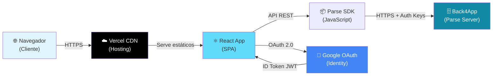
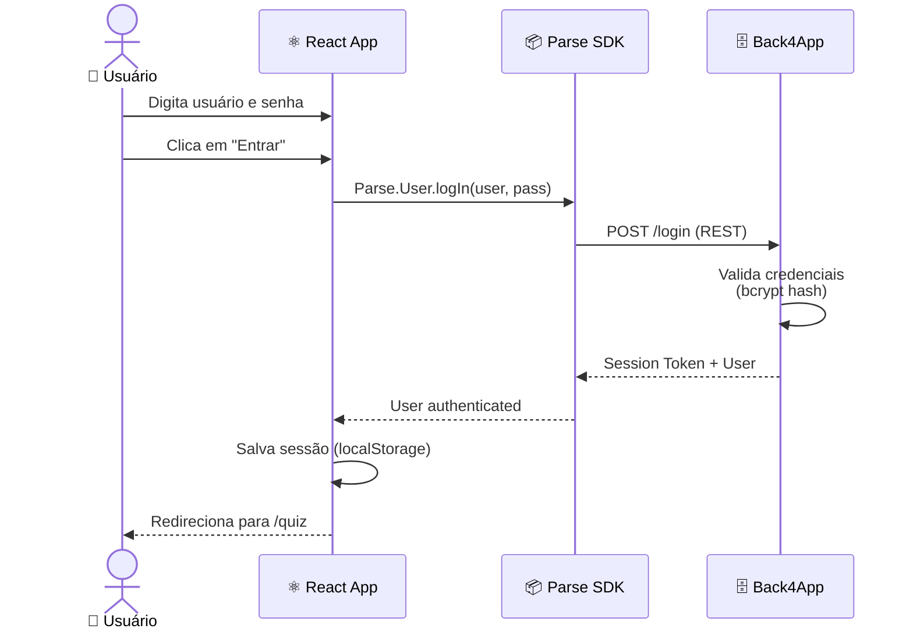
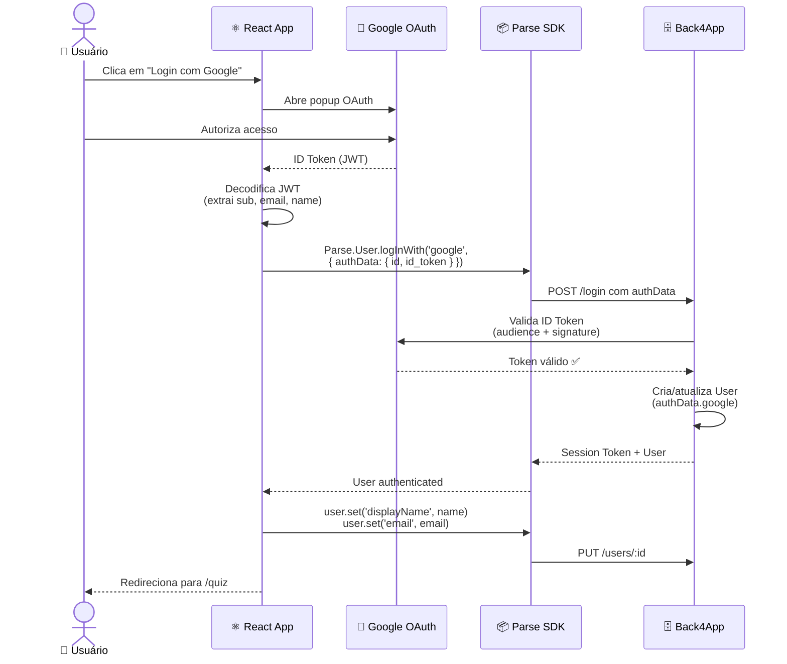
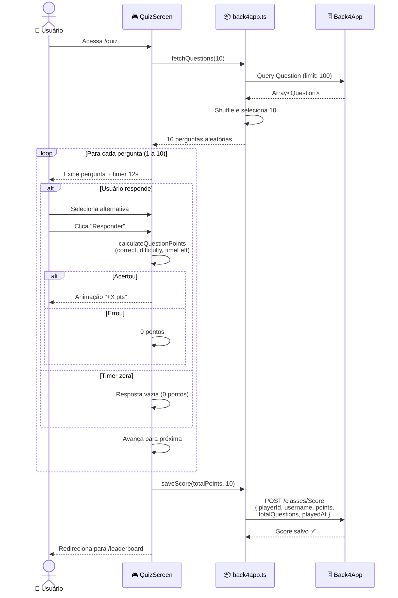
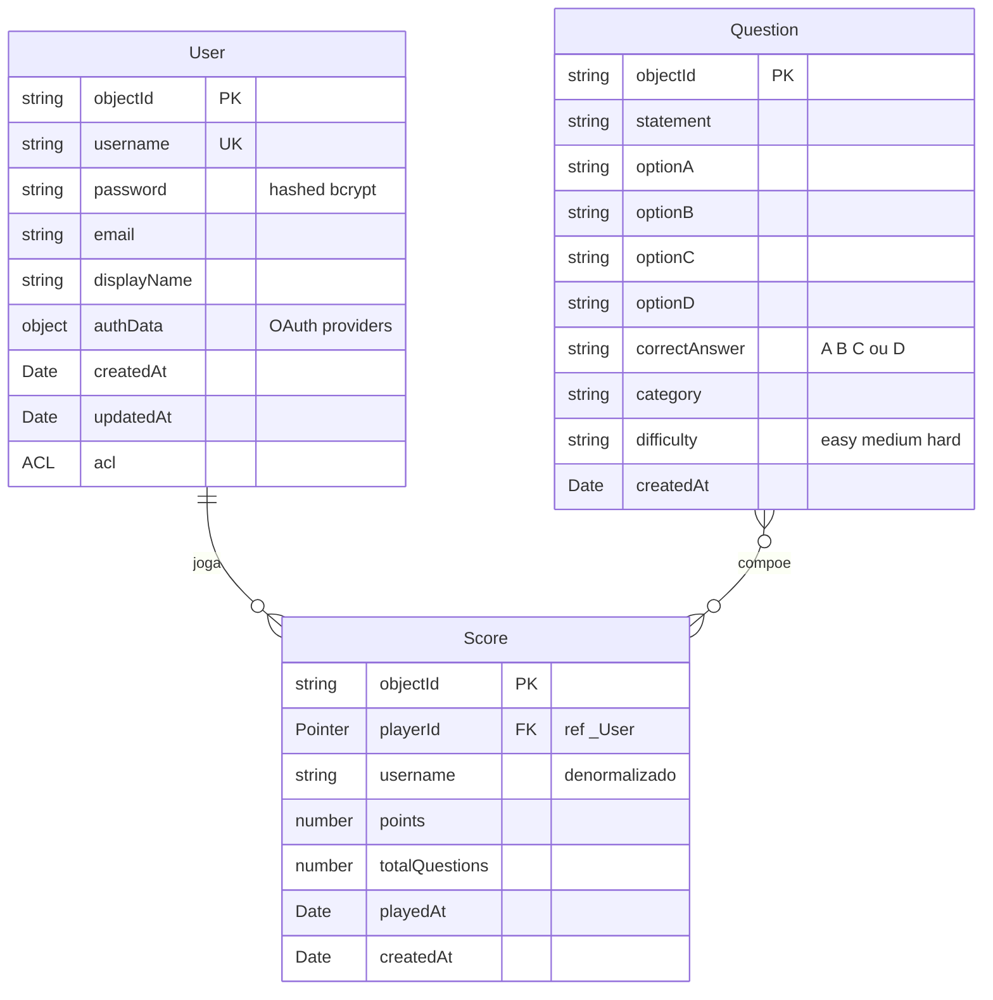
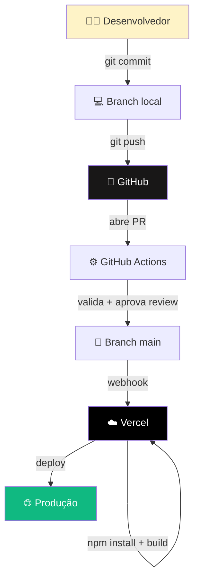

# 🏛️ Arquitetura do CloudQuiz

Este documento descreve a arquitetura técnica do CloudQuiz, incluindo diagramas de fluxo, modelo de dados, decisões técnicas e pipeline de deploy.

---

## 📐 Visão Geral

O CloudQuiz segue uma arquitetura **cliente-servidor desacoplada**, com frontend SPA (Single Page Application) consumindo um BaaS (Backend-as-a-Service) gerenciado.



### Camadas

1. **Apresentação (Browser)**: navegador do usuário renderiza a SPA
2. **Distribuição (Vercel)**: CDN serve os arquivos estáticos com HTTPS
3. **Aplicação (React + TypeScript)**: lógica de UI, roteamento e estado
4. **Serviços (Parse SDK)**: camada de abstração para comunicação com o backend
5. **Backend (Back4App)**: persistência, autenticação e regras de negócio
6. **Identidade (Google)**: provedor externo de autenticação OAuth

---

## 🔐 Fluxo de Autenticação

### Login Tradicional (Usuário/Senha)



### Login com Google OAuth 2.0



### Por que JWT (id_token) e não access_token?

O `access_token` do Google é usado para **chamar APIs do Google** (ler email, perfil, etc), enquanto o `id_token` é um **JWT assinado** que prova quem é o usuário. O Parse Server valida a assinatura do JWT contra as chaves públicas do Google, garantindo que o token é autêntico e não foi forjado. Esse é o padrão **OpenID Connect** (OIDC).

---

## 🎮 Fluxo do Quiz



### Fórmula de pontuação

```
pontos_por_pergunta = (10 × multiplicador_dificuldade) + tempo_restante

multiplicadores:
  easy   → 1.0  (base 10)
  medium → 1.5  (base 15)
  hard   → 2.0  (base 20)

tempo_restante: 0 a 12 (segundos)

Resposta errada ou timeout: 0 pontos
```

**Exemplo**: pergunta `hard` (multiplicador 2x) respondida com **8 segundos sobrando**:
```
pontos = (10 × 2) + 8 = 28 pts
```

---

## 🗄️ Modelo de Dados

### Classes no Back4App



### Estratégia de denormalização

Note que a classe **`Score`** salva o `username` como **string direto**, mesmo já tendo o `playerId` como Pointer. Isso é uma decisão **proposital** de denormalização:

**Problema original**: ACLs individuais do Parse impedem que um usuário leia dados de outros `_User`. Isso fazia o leaderboard mostrar "Anônimo" para todos os jogadores exceto o próprio.

**Solução**: ao gravar o Score, copiamos o `username` (ou `displayName` se for usuário Google) diretamente para o registro. O leaderboard lê apenas a classe `Score`, sem precisar fazer JOIN com `_User`.

**Trade-off**: se o usuário trocar de nome, os scores antigos manterão o nome anterior. Para um quiz acadêmico, isso é aceitável.

---

## 🚀 Pipeline CI/CD



### Etapas do pipeline

1. **Desenvolvimento local**
   - Desenvolvedor cria branch `feature/nome-da-feature` a partir de `main`
   - Faz commits semânticos seguindo Conventional Commits
   - Push para o GitHub

2. **Pull Request**
   - PR aberta tem reviewers atribuídos
   - Quando aprovada (review type `APPROVED`), o workflow `ci.yaml` dispara

3. **Merge automatizado (GitHub Actions)**
   - Workflow detecta PR aprovada com prefixo `feature/`, `bugfix/` ou `release/`
   - Faz merge automático na `main`
   - Deleta a branch da feature

4. **Deploy automatizado (Vercel)**
   - Vercel recebe webhook do GitHub no push para `main`
   - Roda `npm install` + `npm run build`
   - Faz deploy para `https://cloud-quiz-one.vercel.app`
   - Preview deployments também são criados para cada PR aberta

---

## 🎨 Decisões Técnicas

### Por que Vite ao invés de Create React App?

- ✅ **Velocidade**: dev server inicia em ~200ms vs ~5s do CRA
- ✅ **Build otimizado**: usa Rollup com tree-shaking agressivo
- ✅ **Hot Module Replacement** instantâneo
- ✅ **Manutenção ativa** (CRA foi descontinuado pelo time do React)

### Por que Back4App (Parse) ao invés de Firebase?

- ✅ **Tier gratuito generoso** (sem cobrança por leitura)
- ✅ **REST API completa** sem necessidade de SDK proprietário
- ✅ **Open source** (Parse Platform)
- ✅ **CLPs e ACLs granulares** para segurança
- ✅ **Cloud Code** disponível para lógica server-side

### Por que TypeScript?

- ✅ **Type safety** previne bugs em tempo de desenvolvimento
- ✅ **Autocomplete** rico no VS Code
- ✅ **Refatorações seguras**
- ✅ **Documentação implícita** via tipos
- ✅ Padrão da indústria para projetos React modernos

### Por que Tailwind CSS?

- ✅ **Utility-first**: estilização rápida sem CSS separado
- ✅ **Bundle pequeno**: PurgeCSS remove classes não usadas
- ✅ **Design system consistente** via configuração
- ✅ **Sem class name collisions**

### Por que Vercel ao invés de Netlify ou GitHub Pages?

- ✅ **Suporte nativo a Vite** (detecção automática)
- ✅ **Preview deployments** em cada PR
- ✅ **Edge Network** global
- ✅ **Integração GitHub** zero-config
- ✅ **Rollback instantâneo** via dashboard

### Por que Google OAuth ao invés de Facebook ou GitHub OAuth?

- ✅ **Maior alcance** (quase todo brasileiro tem conta Google)
- ✅ **Documentação madura**
- ✅ **Tela de consentimento clara**
- ✅ Padrão OAuth 2.0 / OpenID Connect

---

## 🔒 Considerações de Segurança

### Frontend
- Chaves do Back4App e Google Client ID em **variáveis de ambiente** (`VITE_*`)
- `.env` no `.gitignore`, `.env.example` versionado com placeholders
- Validação básica de inputs (length, formato, campos obrigatórios)
- Routes protegidas via `ProtectedRoute` component

### Backend (Back4App)
- **Class Level Permissions (CLPs)** restritivas:
  - `_User`: Get/Find/Create públicos; Update/Delete bloqueados
  - `Question`: somente leitura pública
  - `Score`: leitura pública, escrita autenticada
- **Senhas** hasheadas com **bcrypt** (padrão do Parse Server)
- **Session Tokens** com expiração configurada

### Autenticação Google
- ID Tokens (JWT) validados pelo Parse Server contra chaves públicas do Google
- Audience (`aud`) do token verificado contra o Client ID do projeto
- Test users explícitos durante desenvolvimento (modo Testing do OAuth Consent Screen)

### Transporte
- **HTTPS obrigatório** em produção (Vercel força redirect)
- CORS configurado pelo Back4App (only allowed origins)

---

## 📊 Métricas e Limites

| Recurso | Limite (free tier) |
|---------|--------------------|
| Vercel — builds/mês | 100 |
| Vercel — bandwidth/mês | 100 GB |
| Back4App — requests/min | 25.000 |
| Back4App — armazenamento | 100 MB |
| Google OAuth — test users | 100 |

Esses limites são **mais que suficientes** para um projeto acadêmico e até para uso em produção de pequeno porte.

---

## 🔮 Possíveis Evoluções Arquiteturais

Se o projeto evoluísse para produção real:

1. **Cloud Code (Parse)**: mover lógica sensível (cálculo de pontos, validação anti-cheat) para o server-side
2. **Rate limiting**: prevenir abuse das APIs públicas
3. **Cache**: usar SWR/React Query para cachear perguntas e leaderboard
4. **Testes**: adicionar testes E2E (Playwright) e unitários (Vitest)
5. **Observabilidade**: integrar Sentry para tracking de erros em produção
6. **Análise**: integrar Vercel Analytics ou Plausible
7. **Internacionalização**: usar i18next para suporte multi-idioma

---

<div align="center">

**🏛️ Arquitetura projetada com foco em simplicidade, escalabilidade e DX**

[← Voltar ao README](./README.md)

</div>
