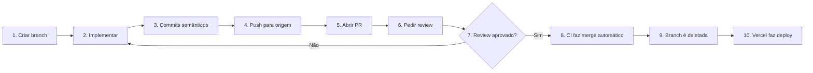

# 🤝 Guia de Contribuição

Obrigado por considerar contribuir com o CloudQuiz! Este documento descreve as convenções e o fluxo de trabalho do projeto.

---

## 🌳 Estrutura de Branches

O projeto usa o modelo **GitHub Flow** simplificado:

```
main                  ← branch principal (produção)
 ├── feature/*        ← novas funcionalidades
 ├── bugfix/*         ← correções de bugs
 └── release/*        ← preparação de releases
```

### Regras

- ❌ **Nunca commitar direto na `main`**
- ✅ Sempre criar uma branch para sua mudança
- ✅ Use prefixos descritivos: `feature/`, `bugfix/`, `release/`
- ✅ Use nomes curtos e claros: `feature/google-login`, não `feature/implementacao-do-novo-login-com-google-oauth`

### Como criar uma branch nova

```bash
# Garantir que a main está atualizada
git checkout main
git pull origin main

# Criar nova branch a partir da main
git checkout -b feature/nome-da-feature
```

---

## ✍️ Convenção de Commits

Seguimos a especificação [Conventional Commits](https://www.conventionalcommits.org/pt-br/).

### Formato

```
<tipo>: <descrição curta em minúsculas e sem ponto final>

[corpo opcional explicando o porquê]

[rodapé opcional com referências, ex: Closes #123]
```

### Tipos disponíveis

| Tipo       | Quando usar                                            | Exemplo                                                      |
|------------|--------------------------------------------------------|--------------------------------------------------------------|
| `feat`     | Nova funcionalidade                                    | `feat: adiciona login com Google`                            |
| `fix`      | Correção de bug                                        | `fix: corrige username ausente no leaderboard`               |
| `chore`    | Tarefas de manutenção (deps, configs)                  | `chore: atualiza dependencias do parse`                      |
| `docs`     | Apenas documentação                                    | `docs: atualiza README com link de producao`                 |
| `style`    | Formatação, sem mudança de lógica                      | `style: ajusta indentacao do QuizScreen`                     |
| `refactor` | Refatoração sem mudança de comportamento               | `refactor: extrai logica de scoring para servico separado`   |
| `test`     | Adicionar ou ajustar testes                            | `test: adiciona teste para calculateQuestionPoints`          |
| `perf`     | Melhoria de performance                                | `perf: otimiza renderizacao do leaderboard`                  |
| `ci`       | Mudanças no pipeline CI/CD                             | `ci: adiciona step de lint no workflow`                      |

### Boas práticas

✅ **Bom**:
```
feat: implementa quiz, leaderboard e configuracao de rotas
fix: corrige username ausente no leaderboard
chore: configura Vite com polyfill events para Parse SDK
```

❌ **Ruim**:
```
mudanças          # tipo ausente, descrição vaga
Feat: Update      # tipo capitalizado, descrição sem informação
fix bug.          # ponto final, descrição vaga
```

### Por que sem acentos nas mensagens?

Por compatibilidade com o terminal do Windows (PowerShell), as mensagens de commit são escritas **sem acentos**. Isso evita problemas de encoding em algumas configurações.

Acentos são bem-vindos em **conteúdo de arquivos** (UI, comentários, README).

---

## 🔄 Fluxo de Pull Request



### Passo a passo

1. **Criar branch** a partir da `main` atualizada
2. **Implementar** a mudança
3. **Commits semânticos** seguindo Conventional Commits
4. **Push** para o GitHub:
   ```bash
   git push origin feature/sua-feature
   ```
5. **Abrir PR** no GitHub:
   - Base: `main` ← Compare: `feature/sua-feature`
   - Título seguindo convenção: `feat: descricao curta`
   - Descrição rica com:
     - 📋 Resumo
     - ✨ Funcionalidades
     - 🏗️ Arquivos alterados
     - 🧪 Testes manuais realizados
6. **Atribuir reviewers** no painel direito da PR
7. **Avisar o reviewer** por outro canal (WhatsApp, Slack)
8. **Aguardar review**: quando aprovado, o workflow do CI dispara automaticamente
9. **Merge automático**: o workflow `ci.yaml` detecta o `APPROVED` e faz o merge
10. **Deploy**: Vercel detecta o push na `main` e faz deploy em produção

### ⚠️ Atenção

- O workflow do CI **só dispara quando uma review é submetida como `APPROVED`**
- Após aprovação, a branch é **deletada automaticamente**
- Push adicional após aprovação **não é possível** (branch deletada)
- Por isso, **garanta que tudo está pronto** antes de pedir review

---

## 📋 Checklist antes de pedir review

Antes de clicar em "Request review", confira:

- [ ] Todos os commits seguem o padrão Conventional Commits?
- [ ] `npx tsc --noEmit` passa sem erros?
- [ ] `npm run build` completa sem warnings críticos?
- [ ] Não tem `console.log` ou código de debug esquecido?
- [ ] `.env` NÃO está no commit?
- [ ] Nenhuma chave sensível foi exposta no código?
- [ ] PR tem descrição clara e completa?
- [ ] Testou manualmente o fluxo da feature?
- [ ] Funciona em produção (na URL de preview da Vercel)?

---

## 🐛 Reportando Bugs

Se encontrar um bug em produção:

1. Reproduza o bug em ambiente local primeiro
2. Verifique se já existe uma issue aberta
3. Se não, abra uma issue descrevendo:
   - **O que aconteceu** (comportamento observado)
   - **O que deveria acontecer** (comportamento esperado)
   - **Passos para reproduzir** (1, 2, 3...)
   - **Ambiente** (navegador, OS)
   - **Screenshots** ou logs do console

---

## 💡 Sugerindo Features

Para sugerir novas funcionalidades:

1. Abra uma issue com prefixo `[Feature Request]`
2. Descreva o **problema que resolve**, não apenas a solução
3. Aguarde discussão antes de começar a implementação
4. Se aprovado, crie uma branch `feature/nome-da-sugestao`

---

## 🧪 Rodando o Projeto Localmente

Veja as instruções no [README.md](./README.md#-como-rodar-localmente).

---

## 📐 Padrões de Código

### TypeScript
- ✅ Use **tipos explícitos** em funções públicas
- ✅ Use `interface` para tipos de objetos
- ✅ Use `type` para uniões e aliases
- ❌ Evite `any` exceto onde absolutamente necessário (Parse SDK)
- ❌ Não use `// @ts-ignore` sem comentário explicando

### React
- ✅ Componentes funcionais com hooks
- ✅ Um componente por arquivo
- ✅ Nome do arquivo == nome do componente (`LoginScreen.tsx`)
- ✅ Use `useCallback` e `useMemo` quando necessário (não por default)
- ❌ Evite re-renders desnecessários

### Estilização
- ✅ Use **Tailwind CSS** utility classes
- ✅ Mantenha consistência com a paleta de cores existente (teal, gray, red, amber, green)
- ❌ Não crie arquivos `.css` separados (exceto `index.css` global)

### Imports
```typescript
// 1. Imports externos
import { useState } from 'react';
import { useNavigate } from 'react-router-dom';

// 2. Imports de bibliotecas third-party
import { GoogleLogin } from '@react-oauth/google';

// 3. Imports do projeto (services, context, components)
import { useAuth } from '../context/AuthContext';
import { fetchQuestions } from '../services/back4app';

// 4. Imports de tipos
import type { Question } from '../services/back4app';
```

---

## 👥 Time do Projeto — Grupo 2

- **Rômulo Azevedo Montenegro Neto**
- **João Gabriel de Holanda Montenegro**
- **Lívia Maria Barreto Albuquerque**
- **Leonardo Oliveira Freitas de Matos**

---

<div align="center">

**🤝 Toda contribuição é bem-vinda!**

[← Voltar ao README](./README.md) · [📐 Architecture](./ARCHITECTURE.md)

</div>
